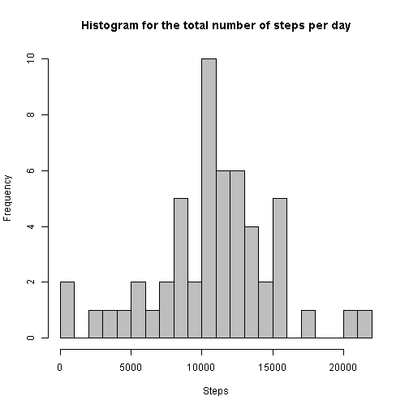
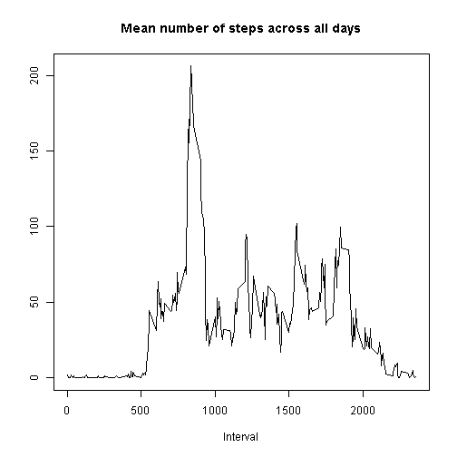
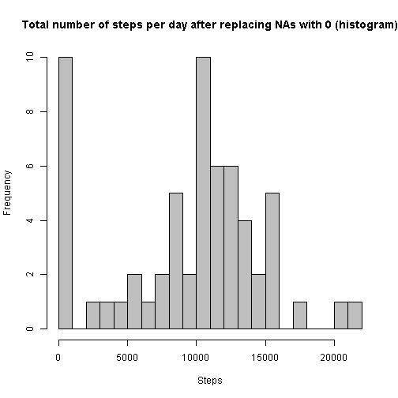
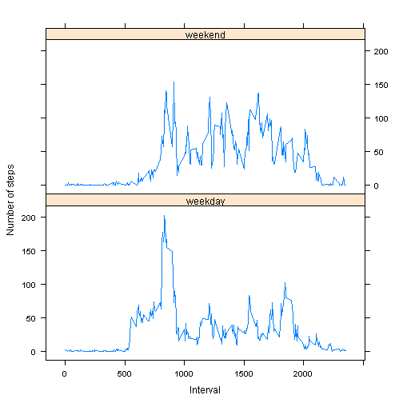

# Reproducible Research: Peer Assessment 1


## Loading and preprocessing the data

```r
setClass('myDate')
setAs("character","myDate", function(from) as.Date(from, format="%Y-%m-%d"))

data <- read.csv(
    "activity.csv",
    header = TRUE,
    sep = ",",
    na.strings = "NA",
    colClasses = c("numeric", "myDate", "numeric")
)
```


## What is mean total number of steps taken per day?

```r
data_steps_notna <- data[!is.na(data$steps), ]

data_agg_sum_by_day <- aggregate(steps ~ date, data_steps_notna, sum)
steps_mean = sprintf(mean(data_agg_sum_by_day$steps), fmt = "%.2f")
steps_median = sprintf(median(data_agg_sum_by_day$steps), fmt = "%.2f")

#library(ggplot2)
#qplot(steps, data = data_agg_sum_by_day)
hist(data_agg_sum_by_day$steps, col = "grey", breaks = 30, xlab = "Steps", main = "Histogram for the total number of steps per day")
```

 

The mean number of steps is 10766.19.  
The median for the number of steps each day is 10765.00.


## What is the average daily activity pattern?

```r
data_agg_mean_by_interval <- aggregate(steps ~ interval, data_steps_notna, mean)

steps_max <- max(data_agg_mean_by_interval$steps)
interval_with_max_steps <-
    data_agg_mean_by_interval[data_agg_mean_by_interval$steps == steps_max, ]$interval

x <- data_agg_mean_by_interval$interval
y <- data_agg_mean_by_interval$steps
plot(x, y, type = "l", xlab = "Interval", ylab = "", main = "Mean number of steps across all days")
```

 

The interval with the maximum number of steps (averaged across all days) is 835
and the mean number of steps in this interval is 206.1698

## Imputing missing values

### 1. Missing values

```r
steps_na_count = nrow(subset(data, is.na(steps)))
```
The number of missing values in column steps is 2304.

### 2. Replacing missing values strategy

The approach is to replace all missing values with 0. In my opinion replacing,
the NAs with the mean or the median might result in an over-estimation
of the average number of steps in that particular day, or for that particular
interval.

### 3. The new dataset data2 will have all it's NA values replaced with 0


```r
data2 <- data
data2[is.na(data2$steps),]$steps = 0
```

### 4. The new dataset data2 will have all it's NA values replaced with 0


```r
data2_agg_sum_by_day <- aggregate(steps ~ date, data2, sum)
steps2_mean = sprintf(mean(data2_agg_sum_by_day$steps), fmt = "%.2f")
steps2_median = sprintf(median(data2_agg_sum_by_day$steps), fmt = "%.2f")


hist(data2_agg_sum_by_day$steps, col = "grey", breaks = 30, xlab = "Steps", main = "Total number of steps per day after replacing NAs with 0 (histogram)")
```

 

The mean number of steps in data set data2 (after having replaced NAs with 0) is 9354.23.  
And the median number is 10395.00.

The mean and the median values differ from the initial data set where the NAs were removed. Now the mean is considerably smaller (9354.23 vs. the initial 10766.19 where the NAs were removed). The median is a bit smaller as well, but not by a lot (10395.00 vs. the initial 10765.00). This is expected as in general the median is more resistant than the mean to outliers or missing values.

## Are there differences in activity patterns between weekdays and weekends?

### 1. Adding the new factor column: weekdays / weekends

```r
data2$daytype <- ifelse(weekdays(data2$date, abbreviate = TRUE) %in% c("Sat", "Sun"), "weekend", "weekday")

# Mean by interval for weekdays
data2_agg_mean_by_interval_weekdays <- aggregate(steps ~ interval, data2[data2$daytype == "weekday", ], mean)
data2_agg_mean_by_interval_weekdays$daytype = "weekday"

# Mean by interval for weekend days
data2_agg_mean_by_interval_weekends <- aggregate(steps ~ interval, data2[data2$daytype == "weekend", ], mean)
data2_agg_mean_by_interval_weekends$daytype = "weekend"

# Consolidate both datasets into one
data2_agg <- rbind(data2_agg_mean_by_interval_weekdays, data2_agg_mean_by_interval_weekends)

# Plot
library(lattice)
xyplot(steps ~ interval | daytype, data = data2_agg, type = "l", layout = c(1, 2), xlab = "Interval", ylab = "Number of steps")
```

 

